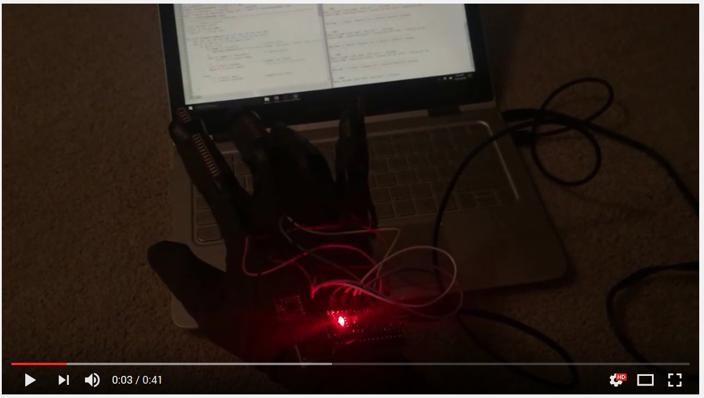

# Insula 

Insula is a wearable device that translates physiological events from sensor data (EEG, ECG, EMG, breath rate, hand gestures) into music in real-time. A heart beat turns into a drum beat, the rise and fall of a breath turns into the tension and release of a chord progression, etc. Here you can find the code that runs under the hood. 

The goal of Insula is to make biodata interesting, meaningful and useful to a diverse set of users. This technology allows users to become mindful of the processes in their bodies through the universal medium of music. I have created all custom hardware and software for the device, building on platforms including Arduino, ChucK OpenBCI and Processing. 

I’ve separated Insula into two components: biological (v1), and tactile (v2). V1 consists of the electrocardiogram, electromyogram, and breath rate sensors, all of which were part of the [original thesis project](docs/thesis_final_insula.pdf) that started Insula. V2 is a new component that introduces flex sensors on each finger and an accelerometer for more intentional control of the music. Insula V1 included an EEG soundscape which ran on OpenBCI, but cannot be found here (a Youtube video still exists [here](youtube.com). Message me if you’re interested on that. 
 
The basic control flow of data is as follows: Data is fed in from the Arduino through Serial, and into ChucK. Sound files are triggered for some events (heart rate, breath), and parameters of sound oscillators are controlled for the flex sensors, accelerometer, and muscles. 
 
## Hardware Overview:

### **Insula V1**

1. **Microcontroller:** [Arduino Nano](https://www.arduino.cc/en/Main/ArduinoBoardNano) the brains of the organization.

2. **Heart-rate monitor:** [Pulse Sensor](http://pulsesensor.com/) for heart-rate detection.

3. **Electromyogram:** [MyoWare](http://www.advancertechnologies.com/p/myoware.html) for electrical data from muscle contractions.

4. **Breath Rate Monitor:**  Consists of a [conductive rubber resistor](https://www.adafruit.com/products/519) in line with a resistor to create a voltage divider. Optional capacitor across the sensor as an RC filter to tease out noise. Data  is cleaned via Arduino, and produces a boolean mapped to inhale/exhale. 

###  Insula V2
1. **[Flex Sensors](https://www.adafruit.com/products/1070)** on each finger, in line with a voltage divider. Optional capacitor across the sensor as an RC filter to tease out noise. 

2. **[Accelerometer](https://learn.sparkfun.com/tutorials/mma8452q-accelerometer-breakout-hookup-guide)**

* see docs for a [schematic](docs/insulaSchematic_2.png) of V2. 

## Software Overview: 
### Arduino: 
Each sensor feeds data into analog inputs on the Arduino, and smoothing/signal processing algorithms, and rate-of-change algorithms are applied as need be. Each sensor can be turned on or off by boolean controls at the top of the main sketch. Insula V1 sensors are also modular with V2. 

### ChucK 
[ChucK](http://chuck.cs.princeton.edu/) is a  programming language for real-time sound synthesis and music creation. I chose ChucK because you can easily generate Ugens, MIDI, and sound oscillators, it is cross-platform, and it allows for super quick experimentation. A few cons are that it is syntactically confusing (similar to C but with unintuitive anomalies) and it is not well documented.  

### Future: 

**Note:** The name Insula comes from the insular cortex of the brain, which is responsible for helping us recognize our own biology. Your insula is what allows you to feel your heartbeat echo through your body when you’re excited, and what makes your feel thirsty after a long run. And that’s why Insula was built: as an avenue to recognize, respond to, and think more creatively and holistically about our own biology.
